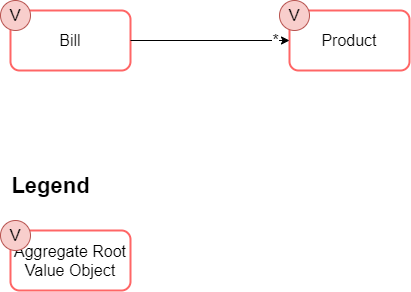

# patterns-domain-model  
Architecture Patterns - simplified sample code

---
## Goal of This
Demontsrating these architecture paterns within working code in a very simplified way.
This might help better understand them.

On the other hand, with the help of this sample code, you will ***not*** see the complictions that come with a huge, complex project.

---
## What You Need for This
 + Visual Studio 2019 - *or higher* - ***Run as Administrator*** - incl.:
    + C# stuff
    + .NET Core 3.1
    + Markdown Editor
 + Also recommended:
    + ReSharper
    + TortoiseGit
    + Notepad++ including XML Tools

---
## How This Was Created
&rarr; [HowCreated.md](HowCreated.md)

---
## Domain Model

---
## Architecture Patterns   <small> *covered in this sample* </small>
 + **D**omain **M**odel
 + **I**nversion **o**f **C**ontrol / **D**ependency **I**njection
 + Repository

### See Also
 + &rarr; [Inversion of Control Containers and the Dependency Injection pattern *(Fowler)*](https://martinfowler.com/articles/injection.html)
